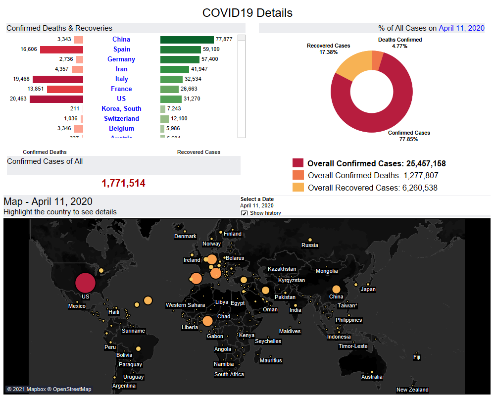

  
  
  

<h1 align="center">COVID-19 Global Visualization</h1>

  An interactive <strong>Tableau dashboard</strong> tracking daily confirmed cases, deaths, and recoveries across countries during the early phase of the COVID-19 pandemic (Jan 22, 2020 – Apr 22, 2020).

---

## Table of Contents

- [Project Overview](#project-overview)
- [Dashboard Preview](#dashboard-preview)
- [Key Features & Visualizations](#key-features--visualizations)
- [Key Business Insights](#key-business-insights)
- [How to Download and Open the `.twbx` File](#how-to-download-and-open-the-twbx-file)
- [Data Source](#data-source)
- [License](#license)

---

## Project Overview

The **COVID-19 Global Visualization** is an interactive Tableau dashboard built to provide a clear, visual understanding of how the COVID-19 pandemic unfolded globally during its critical early months. By consolidating daily data on confirmed cases, deaths, and recoveries across affected countries, this dashboard empowers users — public health professionals, researchers, data analysts, and the general public — to explore trends, compare country-level outcomes, and identify key inflection points in the pandemic timeline.

The dashboard covers the period from **January 22, 2020** through **April 22, 2020**, a window that captures the initial outbreak, global spread, and early recovery trends.

---

## Dashboard Preview

---

## Key Features & Visualizations

The workbook contains four primary views, each designed to answer a distinct analytical question:

### 1. Tornado Chart — Deaths and Recoveries by Country
A side-by-side tornado chart that compares the number of deaths and recoveries across affected countries. This view makes it easy to identify which countries were recovering patients faster versus those experiencing higher mortality rates.

### 2. Donut Chart — Percentage Breakdown
A set of donut charts displaying the share of:
- **Percent of all confirmed cases**
- **Percent of overall deaths**
- **Percent of overall recoveries**

These donut charts provide a quick, at-a-glance understanding of the global distribution of COVID-19 outcomes.

### 3. Map Chart — Spread of Confirmed Cases by Date
An interactive geographic map that visualizes the spread of confirmed cases over time. Users can use the date slider/animation to watch the pandemic expand across continents day by day.

---

## Key Business Insights

The dashboard uncovers several critical insights from the data:

1. **China led in confirmed cases with strong recovery rates**, while the **US led in death cases** — highlighting a stark contrast in early pandemic outcomes between the two most affected nations.

2. **March 7, 2020 marked a critical turning point**, recording the maximum recovery rate of **34.78%** alongside **63.10% confirmed cases**. After this date, the recovery percentage began to decline while death rates continued to climb.

3. **Death rates surged from 2.15% to 4.77%** between March 7 and April 22, 2020, underscoring the escalating severity of the pandemic in the weeks following the initial outbreak.

---

## How to Download and Open the `.twbx` File

A `.twbx` file is a **Tableau Packaged Workbook** — a single archive that contains the workbook (`.twb`) along with all referenced data sources (Excel sheets, images, etc.). Follow the steps below to open and interact with it.

### Option A: Using Tableau Desktop (Recommended)

1. **Download Tableau Desktop** — Visit [Tableau Desktop](https://www.tableau.com/products/desktop/download) and install the latest version. Tableau Desktop is **free** for students and educators.
2. **Download the `.twbx` file** from this repository — Go to the repository's main page, click on the `.twbx` file, and select **Download**.
3. **Open the file** — Double-click the downloaded `.twbx` file, or launch Tableau Desktop and go to **File → Open** to select it.
4. **Interact with the dashboard** — Use the date slider, hover over charts for tooltips, and explore the views.

### Option B: Using Tableau Public (Free, No Install Required)

1. **Download the `.twbx` file** from this repository.
2. Go to [Tableau Public](https://public.tableau.com/s/).
3. Sign up for a free Tableau Public account if you don't have one.
4. Upload the `.twbx` file to Tableau Public to view and share it online.
5. Alternatively, use [Tableau Reader](https://www.tableau.com/products/reader) — a free desktop application that lets you open and interact with `.twbx` files without a Tableau license.

> **Note:** Tableau Reader is a lightweight, free tool specifically designed for opening and viewing packaged workbooks. It does not require any license.

---

## Data Source

The dashboard is powered by **3 Excel sheets** containing a combined total of **21,000+ records** covering:

| Data Sheet | Description |
|---|---|
| Confirmed Cases | Daily cumulative confirmed COVID-19 cases by country |
| Recovered Cases | Daily cumulative recovered COVID-19 cases by country |
| Deaths | Daily cumulative confirmed COVID-19 deaths by country |

**Time Range:** January 22, 2020 – April 22, 2020

---

## License

This project is intended for educational and analytical purposes. The data used reflects publicly available COVID-19 statistics for the specified time period.

---

  Built with Tableau • Data Visualization Portfolio Project

